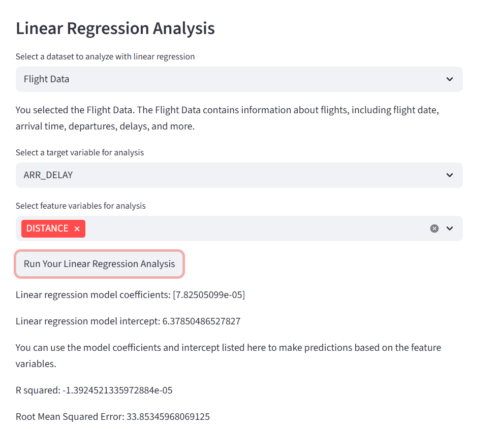
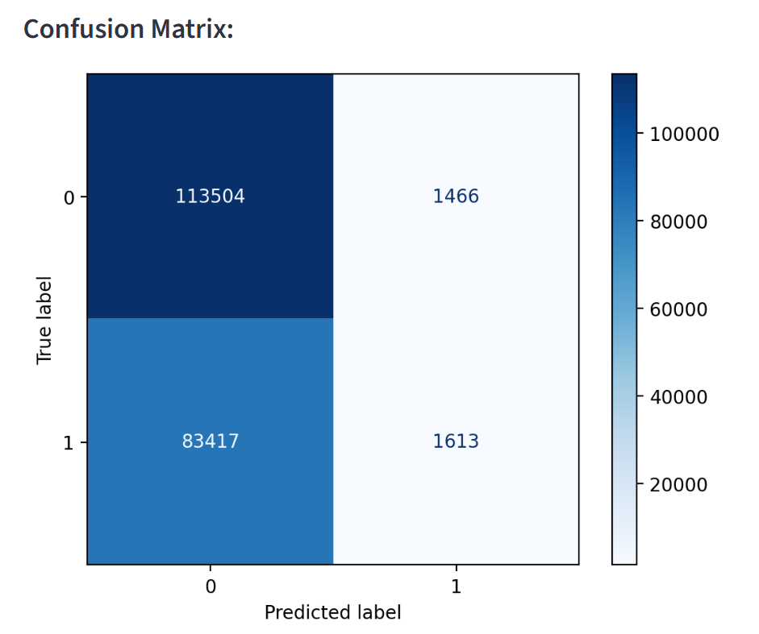
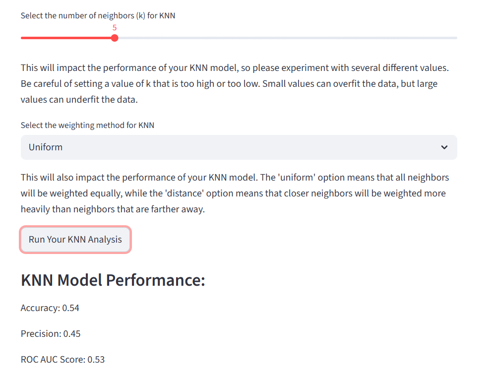
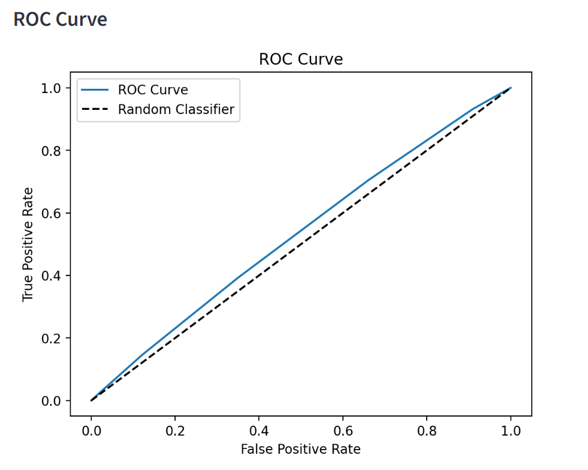

# Machine Learning Streamlit App
This app is designed to walk users through the basics of supervised machine learning. Link to the app: https://github.com/jmarchal403/Marchal-Data-Science-Portfolio/blob/main/MLStreamlitApp/machine_learning_app.py

Using this app, users can experiment with a variety of different performance evaluation metrics (such as accuracy, precision, and ROC curve). They can also manipulate the hyperparameters of several different machine learning models, including linear regression, decision trees, and K nearest neighbors.

Three datasets are provided that the user can choose between:
1. Flight Data - data on flights, arrivals, departures, delays, travel time, and more
2. Weather Data - data on rainfall, sunshine, temperature, wind speed, and other weather related factors
3. Motor Trends Data - data on vehicle model and a list of vehicle performance indicators

All of this data can be found at Agents for Data using this link: https://www.agentsfordata.com/csv/sample

### App Layout

I first introduce users to the app, explaining its function and presenting them with the three datasets available for them to examine.

After presenting users with the data, I offer them the chance to pick a dataset that they would like to explore with linear regression. They are

### Tips for Running this App

Make sure to go and look at the code comments I left in the python file if you are confused about any of the commands I used or what the code itself is actually doing!

Otherwise:
1. When uploading the csv files, make sure that the name of the data you downloaded exactly matches the data you are uploading in python.
2. Ensure that you have the correct libraries and models imported. 
    All imports used in this app:
    import streamlit as st
    import pandas as pd
    from sklearn.linear_model import LinearRegression
    from sklearn.metrics import r2_score, mean_squared_error
    import numpy as np
    from sklearn.model_selection import train_test_split
    from sklearn.tree import DecisionTreeClassifier
    from sklearn.metrics import accuracy_score, precision_score, roc_auc_score
    from sklearn.metrics import classification_report, confusion_matrix, ConfusionMatrixDisplay, roc_curve
    import matplotlib.pyplot as plt
    from sklearn.neighbors import KNeighborsClassifier
3. Do NOT forget to set your working directory to the folder you saved the python file to!

### App Feature Examples 

###### Linear Regression Analysis:

###### Decision Tree Analysis:

###### KNN Analysis:

#### Want to learn more?
Here is a link to an overview on supervised machine learning. It goes over the basics in more detail, and outlines some of the most popular models: https://www.geeksforgeeks.org/machine-learning/supervised-machine-learning/
