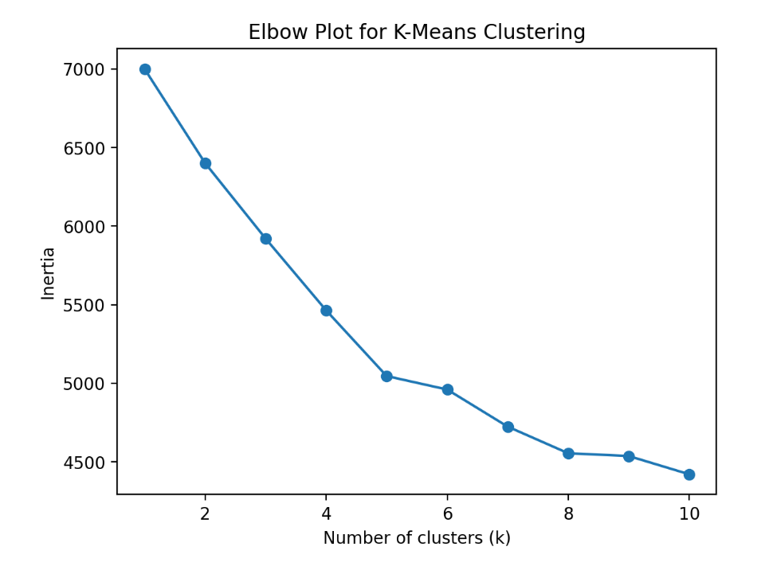
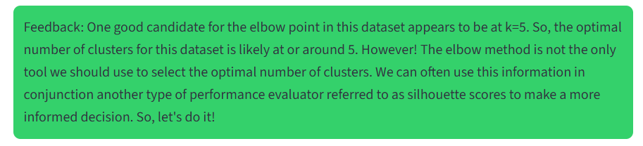
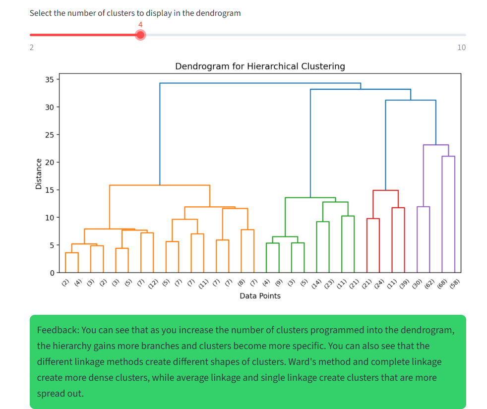
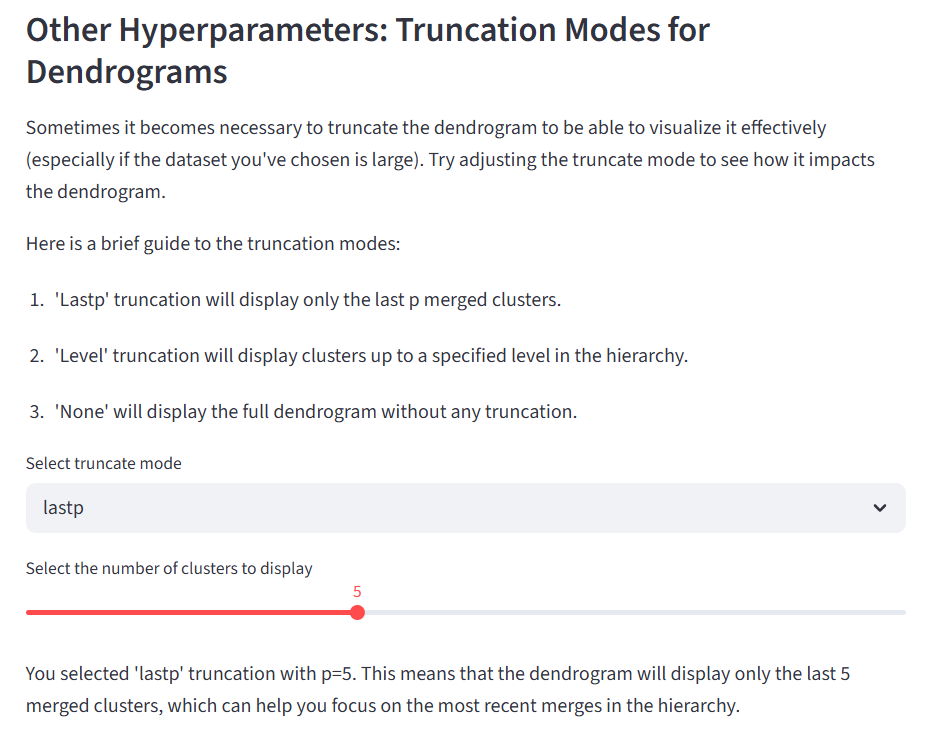
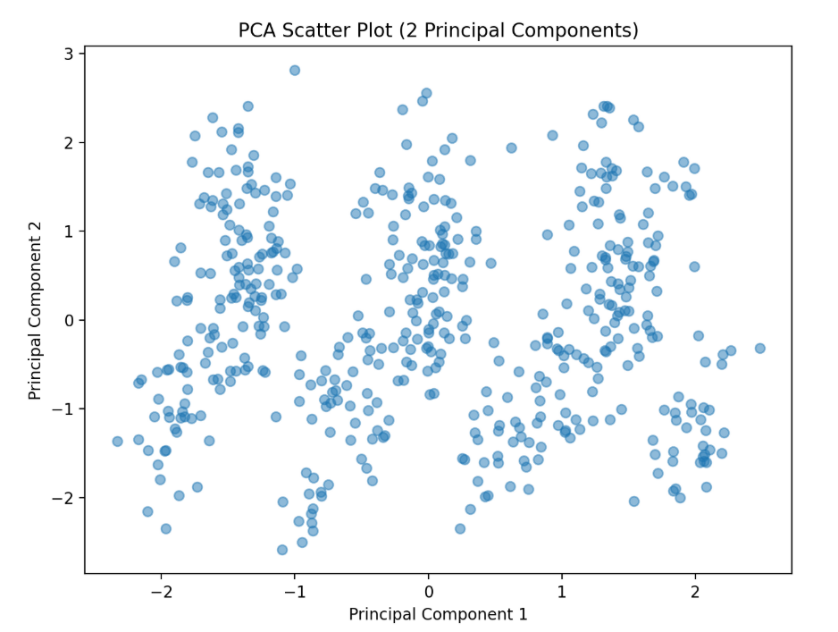
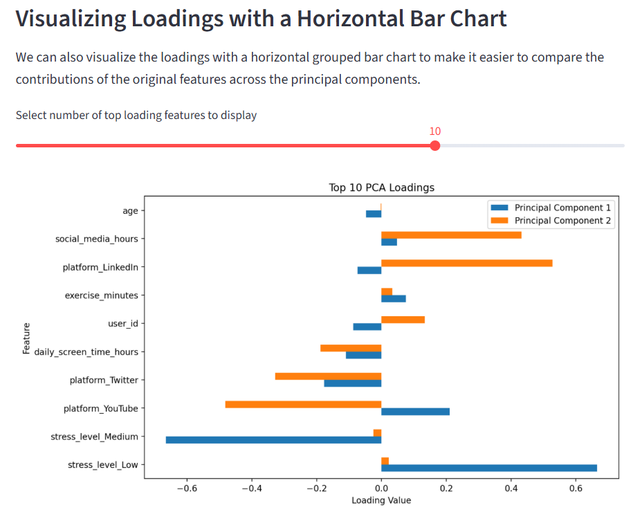

# Unsupervised Machine Learning Streamlit App

This app is designed to walk users through the basics of unsupervised machine learning.

Here is a link to the app uploaded to Streamlit Community Cloud: https://unsupervisedapppy-cswjxzzprzib7nocpjrrse.streamlit.app/

Unsupervised machine learning differs from supervised machine learning in that it attempts to find hidden structures or patterns within the data without actually being given targets or data labels. 

Using this app, users will begin to learn about common methods used to detect these hidden patterns in the data. 3 popular models are provided as options: K-Means Clustering, Hierarchical Clustering, and Principal Component Analysis (PCA). With either their own custom data set or a sample data set provided in the app, users can experiment with each of these three methods and even explore different hyperparameters. 

To train and evaluate the models, performance metrics such as silhouette scores, elbow plots, scatter plots, and dendrograms are displayed alongside feedback sections that describe the purpose of the particular metric and what it means for the user's model. 

### App Layout

This app begins by introducing users to the app and outlining the three main goals of the app:
1. Explore three different unsupervised machine learning techniques: k-means clustering, hierarchical clustering, and principal component analysis (PCA).
2. Experiment with hyperparameters to see how they impact model results.
3. Visualize the results with elbow plots, dendrograms, scatter plots, and silhouette plots to evaluate model performance.

From there, the user is then prompted to either upload a dataset of their own or choose between three sample datasets programmed into the app. All three sample datasets can be found on Kaggle: https://www.kaggle.com/datasets

Once the data has been selected and cleaned, users can toggle between any of the three unsupervised machine learning methods. The general structure of this section is:
1. Introduction to the method
2. Training, visualizations, and model feedback
3. Hyperparameter tuning
4. Conclusion (links to learn more about the particular method included)

Here are the links for reference:  
K-Means Clustering - https://www.ibm.com/think/topics/k-means-clustering  
Hierarchical Clustering - https://www.datacamp.com/tutorial/hierarchical-clustering  
PCA - https://www.turing.com/kb/guide-to-principal-component-analysis  

### Tips for Running the App

1. Make sure to go and look at the code comments I left in the python file if you are confused about any of the commands I used or what the code itself is actually doing!

2. Be sure that you have imported all necessary libraries  
    All imports from this app:  
    import streamlit as st  
    import pandas as pd  
    from sklearn.cluster import KMeans  
    import matplotlib.pyplot as plt  
    from kneed import KneeLocator  
    from sklearn.metrics import silhouette_score  
    from scipy.cluster.hierarchy import dendrogram, linkage  
    from sklearn.cluster import AgglomerativeClustering  
    from sklearn.decomposition import PCA  
    from mpl_toolkits.mplot3d import Axes3D

3. If you are running the app locally, make sure that you have the correct file path for your dataset. Your working directory needs to be set to the folder for this app. 

### App Feature Examples

##### K-Means Clustering: 

##### Hierarchical Clustering:

##### Principal Component Analysis (PCA):

#### Want to learn more?
Here is a guide provided on GeeksForGeeks: https://www.geeksforgeeks.org/machine-learning/unsupervised-learning/
