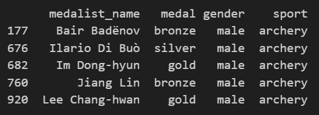
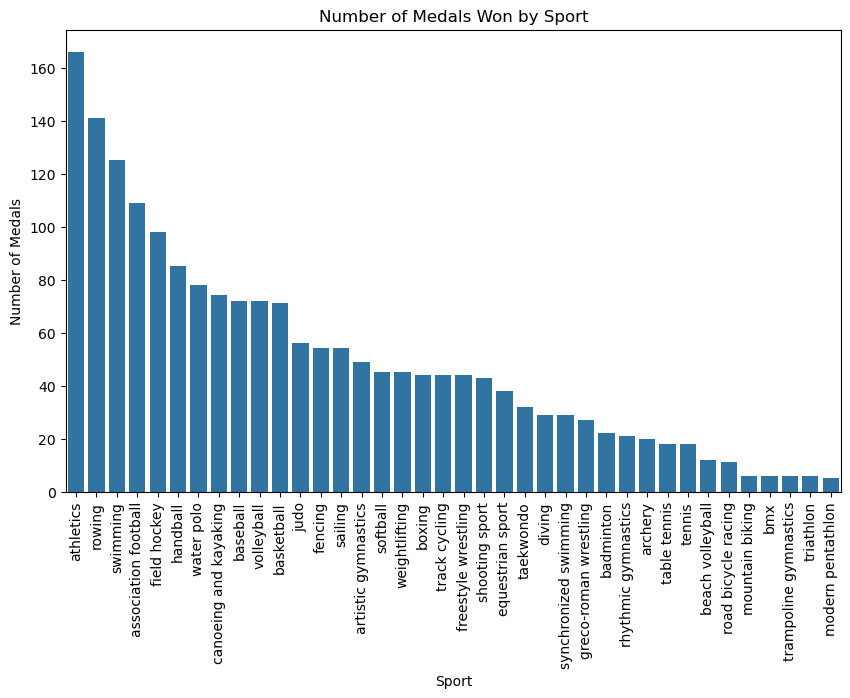
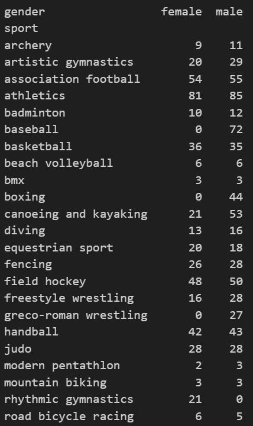

# Project Overview
This is a READ ME file for my Tidy Data Project. This project explores a dataset on the 2008 Olympics medalists through tidy data principles.

The tidy data principles focus on three criteria needed for data analysis and exploration: 
1. Each variable must have its own column
2. Each observation must have its own row
3. Each cell only contains one value

These criteria provide a simple framework to help ensure that your data is prepared for any model, visualization, or manipulation.

If you are interested in learning more about the importance of tidy data, follow this link: https://vita.had.co.nz/papers/tidy-data.pdf

## How do I navigate the notebook?
The notebook is broken up into four larger sections:
1. Loading the data
2. Reshaping the data
3. Data Visualization
4. Pivot Tables

Within each section, there will be blocks of code between markdown cells that will guide you through the data cleaning and manipulation process. In the code blocks themselves, there will be additional comments that explain the actual mechanics of the code. 

It's important to note that I used several key Python libraries for this project: matplotlib, seaborn, and pandas. Here is a pandas cheat sheet in case you'd like to learn more https://pandas.pydata.org/Pandas_Cheat_Sheet.pdf

## Examples From This Data Set
Here are a just a few of the visualizations and tables I produced using this data set.

A brief look at our tidy data:

Visualization of number of medals by sport:

Pivot table of number of medals by gender and sport:

